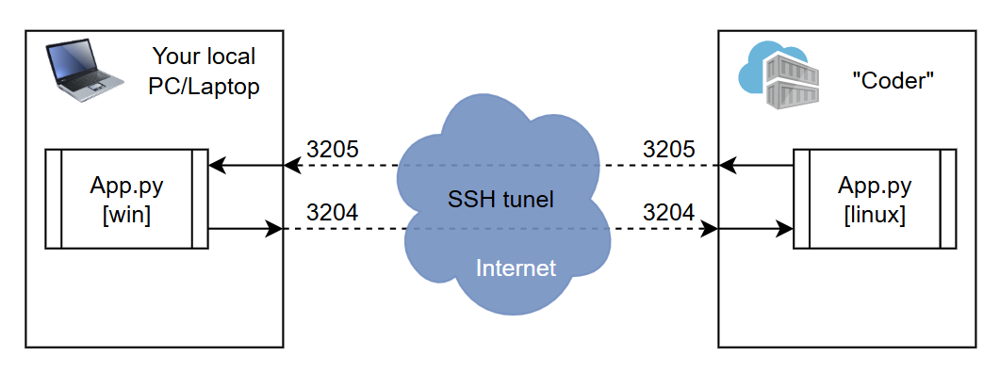
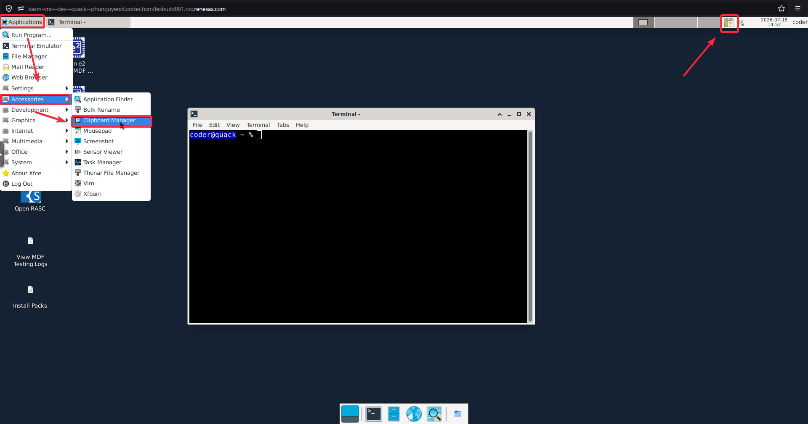

## Status

**STATUS**: `DEV/RAW`

Descriptions:

- `DEV/IDEA`       : Conceptual phase; only covers specific pieces of the main feature.
- `DEV/RAW`        : Core feature implemented, but lacks validation for positive/success cases.
- `DEV/WIP`        : Core feature implemented with basic safety checks and negative case handling. (WIP: Work In Progress)
- `ERR/FATAL`      : Currently disabled or unusable due to critical errors.
- `ERR/MINOR`      : Main feature is usable, but fails under specific conditions or edge cases.
- `RELEASE/STABLE` : Fully implemented, tested, and ready for use.

## About

This script is designed to bidirectionally synchronize the system clipboard (both text and images) between a Windows host and a Linux target over a local socket connection. It is highly effective for bypassing clipboard restrictions in virtualized environments like KasmVNC or headless SSH sessions. It automates the following tasks:

- Detects OS roles dynamically via command-line arguments.
- Synchronizes raw text and image payloads (supporting large buffers up to ~260MB).
- Uses MD5 hashing to ensure data integrity and prevent infinite echo loops.
- Implements an application-level handshake (Magic Strings) to ensure peer readiness before transmitting.



Fig . The illustration about the workflows of ClipboardSync. 

## Disclaimer

> This program/script was created for my own work and is shared here in case others find it useful for a similar need. I am *NOT* responsible for any issues, damage, or risks that may result from running this program/script or any other content from this repository. By *downloading* and *executing* this program/script, you acknowledge that you understand and accept the associated risks.
>
> Please be careful with any program/script that requires `sudo`/`administrator` privileges, especially when downloading and running scripts from external websites.
>
> This program/script is published as open-source under the GNU General Public License (GPL). Feel free to use it for any purpose.
>
> This program/script was developed with the assistance of an LLM/AI model. I have read and verified all generated content, but there may be areas outside my expertise or potential misunderstandings which could cause errors, risks, or damage. Again, please carefully review the code before executing any script or running any program.
>
> BR,  
> Author (And my AI Chat :v).

## Prerequisites

### Windows Host

Requires Python 3.12; Install the required third-party libraries for clipboard management and image processing:

```SHELL
pip install pyperclip Pillow
```

*NOTE*: You may need `--break-system-packages` to install at *System Python Environment*!

### Linux Target (Coder/Ubuntu)

#### universal (universe repo) (optional)

```SHELL
sudo add-apt-repository universe
```

*NOTE*: You may need add this repository to install new app.

### wget  (optional)

```SHELL
sudo apt install wget -y
```

*NOTE*: Ussually already installed in your Coder.

### git  (optional)

```SHELL
sudo apt install git -y
```

*NOTE*: Ussually already installed in your Coder.

#### xclip

Requires Python 3 (usually pre-installed). Install xclip to enable X11 clipboard interactions:

```SHELL
sudo apt install xclip -y
```

*NOTE*: Ussually, it was installed in the Coder. (See the screenshot below)




## Usage/Installation

### Step 1: Establish SSH Tunnel

ssh -L 3205:127.0.0.1:3205 -R 3204:127.0.0.1:3204 user@<your_linux_ip>

```pwsh
ssh -L 3205:127.0.0.1:3205 -R 3204:127.0.0.1:3204 coder.<workspace>
```

*NOTE*: you also choose another couple of TX/RX-port, you need to change the python script incase of changing TX/RX-port.

### Step 2: Run on Linux (Target)

*Step 2.1: Download or copy the script to your Linux workspace. (One time set-up)*

```SHELL
mkdir -p ~/workspace/ClipboardSync/
cd ~/workspace/ClipboardSync/
wget <link to raw file of > 
```

*Step 2.2: Execute the script in Linux mode.*

```SHELL
python3 main.py linux
# or
# python3 ClipboardSync.py linux
```

or

```SHELL
# if you have python-is-python3
python main.py linux
# or
# python ClipboardSync.py linux
```

*NOTE*: 

- You can clone entire the repo instead of clone single file.
- You can manually download from github instead of using `wget`. 
- `main.py` can be changed to another name like: `ClipboardSync.py`
- You may need navigate to the location of `main.py`/`ClipboardSync.py` via `cd ~/workspace/ClipboardSync/` or `cd path/to/the/ClipboardSyncApp`

### Step 3: Run on Windows (Host)

*Step 3.1: Download or copy the script to your Linux workspace. (One time set-up)*

Same to [Step 2](#step-2-run-on-linux-target), you need to download the `main.py`/`ClipboardSync.py`, then run it.

```PWSH
mkdir -p ~/workspace/ClipboardSync/
cd ~/workspace/ClipboardSync/
wget <link to raw file of > 
```
*NOTE*: 

- You can clone entire the repo instead of clone single file.
- You can manually download from github instead of using `wget`. 
- `main.py` can be changed to another name like: `ClipboardSync.py`
- You may need navigate to the location of `main.py`/`ClipboardSync.py` via `cd ~/workspace/ClipboardSync/` or `cd path/to/the/ClipboardSyncApp`

*Step 3.2: Execute the script in Linux mode.*

```SHELL
python3 main.py linux
# or
# python3 ClipboardSync.py linux
```

or

```SHELL
# if you have python-is-python3
python main.py linux
# or
# python ClipboardSync.py linux
```

## Demonstration / Screenshots


