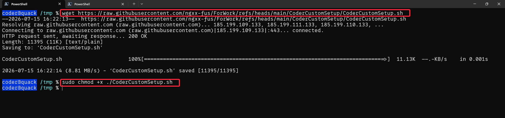
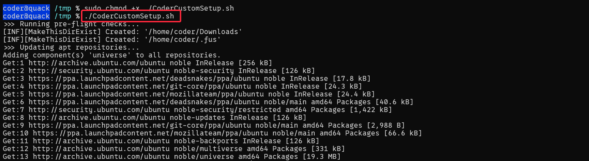
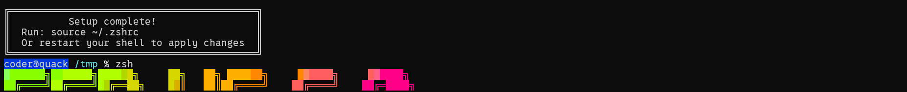

## Status

**STATUS**: `DEV/WIP`

Descriptions:
- `DEV/IDEA`       : Conceptual phase; only covers specific pieces of the main feature.
- `DEV/RAW`        : Core feature implemented, but lacks validation for positive/success cases.
- `DEV/WIP`        : Core feature implemented with basic safety checks and negative case handling.
- `ERR/FATAL`      : Currently disabled or unusable due to critical errors.
- `ERR/MINOR`      : Main feature is usable, but fails under specific conditions or edge cases.
- `RELEASE/STABLE` : Fully implemented, tested, and ready for use.

## About

This script is designed to set up an Ubuntu-based Coder workspace. It automates the following tasks:
- Installs Neovim and applies custom configurations.
- Installs Oh-My-Zsh, useful plugins (zsh-syntax-highlighting, zsh-autosuggestions, zsh-z), and a custom theme.
- Configures user-specific aliases.

## Disclaimer

> This program/script was created for my own work and is shared here in case others find it useful for a similar need. I am *NOT* responsible for any issues, damage, or risks that may result from running this program/script or any other content from this repository. By *downloading* and *executing* this program/script, you acknowledge that you understand and accept the associated risks.
>
> Please be careful with any program/script that requires `sudo`/`administrator` privileges, especially when downloading and running scripts from external websites.
>
> This program/script is published as open-source under the GNU General Public License (GPL). Feel free to use it for any purpose. 
> 
> This program/script was developed with the assistance of an LLM/AI model. I have read and verified all generated content, but there may be areas outside my expertise or potential misunderstandings which could cause errors, risks, or damage. Again, please carefully review the code before executing any script or running any program.
> 
> BR,  
> Author (And my AI Chat :v).

## Prerequisites

### universal (universe repo) (optional)

```SHELL
sudo add-apt-repository universe
```

### wget

```SHELL
sudo apt install wget -y
```

### git

```SHELL
sudo apt install git -y
```

## Usage/Installation

### Method 1: Direct Download (wget)

*Step 1: Create and navigate to the temporary directory*

```SHELL
mkdir -p /tmp/setup && cd /tmp/setup
```

*Step 2: Download the script via wget*

```SHELL
wget <link_to_raw_file_of_CoderCustomSetup.sh>
```

*Step 3: Make the script executable*

```SHELL
sudo chmod +x ./CoderCustomSetup.sh
```

*Step 4: Execute the script*

```SHELL
./CoderCustomSetup.sh
```

### Method 2: Clone Repository


*Step 1: Clone the entire repository*

```SHELL
git clone https://github.com/ngxx-fus/ForWork.git /tmp/ForWork
```

*Step 2: Navigate to the script directory*

```SHELL
cd /tmp/ForWork/CoderCustomSetup
```

*Step 3: Make the script executable*

```SHELL
sudo chmod +x ./CoderCustomSetup.sh
```

*Step 4: Execute the script*

```SHELL
./CoderCustomSetup.sh
```


## Demonstration / Screenshots

## Method 1: Direct Download (wget)


*Step1,2,3*



*Step4*




