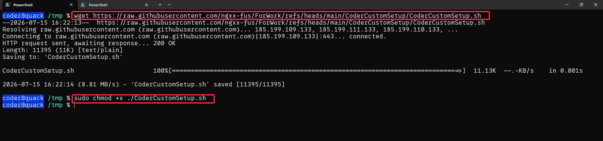
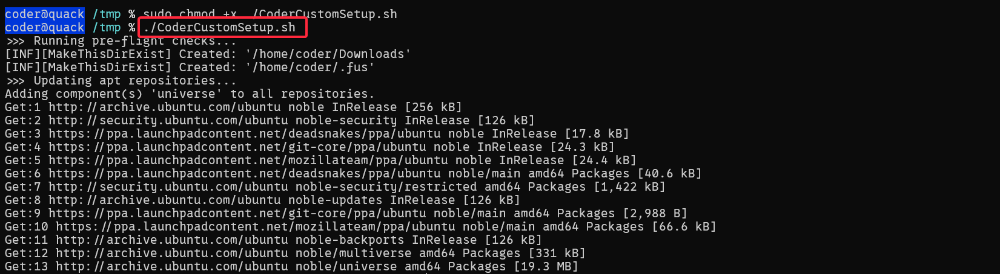
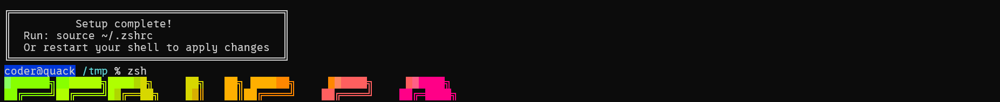

## Status
**STATUS**: `DEV/WIP`
Descriptions:
- `DEV/IDEA`       : Conceptual phase; only covers specific pieces of the main feature.
- `DEV/RAW`        : Core feature implemented, but lacks validation for positive/success cases.
- `DEV/WIP`        : Core feature implemented with basic safety checks and negative case handling.
- `ERR/FATAL`      : Currently disabled or unusable due to critical errors.
- `ERR/MINOR`      : Main feature is usable, but fails under specific conditions or edge cases.
- `RELEASE/STABLE` : Fully implemented, tested, and ready for use.

## About
This script is designed to set up an Ubuntu-based Coder workspace. It automates the following tasks:
- Installs Neovim (optional) and applies custom configurations with prerequisites.
- Installs Oh-My-Zsh, useful plugins (zsh-syntax-highlighting, zsh-autosuggestions, zsh-z), and a custom theme (`ngxxfus`).
- Configures user-specific aliases.
- Installs SEGGER J-Link tools (`JLink_Linux_V950`).
- Downloads and manages desktop background wallpaper (with optional auto-apply support).

## Disclaimer
> This program/script was created for my own work and is shared here in case others find it useful for a similar need. I am *NOT* responsible for any issues, damage, or risks that may result from running this program/script or any other content from this repository. By *downloading* and *executing* this program/script, you acknowledge that you understand and accept the associated risks.
>
> Please be careful with any program/script that requires `sudo`/`administrator` privileges, especially when downloading and running scripts from external websites.
>
> This program/script is published as open-source under the GNU General Public License (GPL). Feel free to use it for any purpose. 
> 
> This program/script was developed with the assistance of an LLM/AI model. I have read and verified all generated content, but there may be areas outside my expertise or potential misunderstandings which could cause errors, risks, or damage. Again, please carefully review the code before executing any script or running any program.
> 
> BR,  
> Author (And my AI Chat :v).

## Prerequisites
### Passwordless Sudo or Active Sudo Session
The script requires `sudo` privileges for APT operations and installing binary files. Ensure your user has passwordless sudo or run a sudo command prior to executing the script.

### universal (universe repo) (optional)
```SHELL
sudo add-apt-repository universe
```

### wget & curl
```SHELL
sudo apt update && sudo apt install wget curl -y
```

### git
```SHELL
sudo apt install git -y
```

## Configuration Flags
Inside the script, you can toggle features by changing global flags (`1` to enable, `0` to disable):

```SHELL
export SETUP_OHMYZSH_EN=1
export SETUP_NVIM_EN=0
export SETUP_NVIM_PREREQUISITES_EN=1        # only works if SETUP_NVIM_EN=1
export SETUP_ADD_APT_REPO_EN=1
export SETUP_USER_ALIASES_EN=1
export SETUP_JLINK_EN=1
export SETUP_BACKGROUND_EN=1
export SETUP_AUTO_SET_BACKGROUND_EN=0       # only works if SETUP_BACKGROUND_EN=1
```

## Usage/Installation

### Method 1: Direct Download (wget)
*Step 1: Create and navigate to the temporary directory*
```SHELL
mkdir -p /tmp/setup && cd /tmp/setup
```
*Step 2: Download the script via wget*
```SHELL
wget https://raw.githubusercontent.com/ngxx-fus/ForWork/main/CoderCustomSetup/setup.sh -O CoderCustomSetup.sh
```
*Step 3: Make the script executable*
```SHELL
chmod +x ./CoderCustomSetup.sh
```
*Step 4: Execute the script*
```SHELL
bash ./CoderCustomSetup.sh
```

### Method 2: Clone Repository

*Step 1: Clone the entire repository*
```SHELL
git clone https://github.com/ngxx-fus/ForWork.git /tmp/ForWork
```
*Step 2: Navigate to the script directory*
```SHELL
cd /tmp/ForWork/CoderCustomSetup
```
*Step 3: Make the script executable*
```SHELL
chmod +x ./CoderCustomSetup.sh
```
*Step 4: Execute the script*
```SHELL
bash ./CoderCustomSetup.sh
```

*Step 5: Apply changes to shell*
```SHELL
source ~/.zshrc
```

## Demonstration / Screenshots
## Method 1: Direct Download (wget)

*Step 1,2,3*


*Step 4*


```